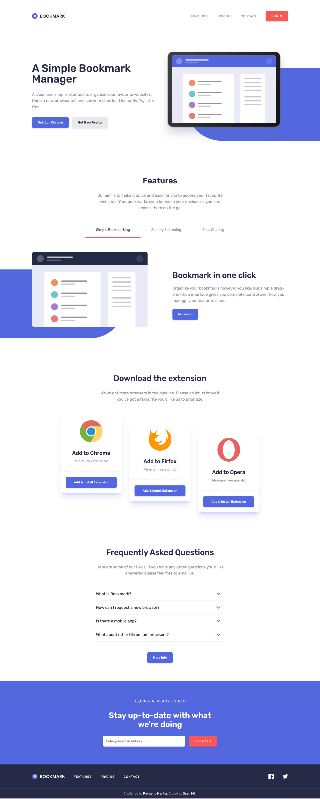

# Frontend Mentor - Bookmark landing page solution

This is a solution to the [Bookmark landing page challenge on Frontend Mentor](https://www.frontendmentor.io/challenges/bookmark-landing-page-5d0b588a9edda32581d29158). Frontend Mentor challenges help you improve your coding skills by building realistic projects. 

## Table of contents

- [Overview](#overview)
  - [The challenge](#the-challenge)
  - [Screenshot](#screenshot)
  - [Links](#links)
- [My process](#my-process)
  - [Built with](#built-with)
  - [What I learned](#what-i-learned)
  - [Continued development](#continued-development)
  - [Useful resources](#useful-resources)
- [Author](#author)

## Overview

### The challenge

Users should be able to:

- View the optimal layout for the site depending on their device's screen size
- See hover states for all interactive elements on the page
- Receive an error message when the newsletter form is submitted if:
  - The input field is empty
  - The email address is not formatted correctly

### Screenshot



### Links

- Solution URL: [View on Netlify](https://fem-bookmark-landing-page-seanhillweb.netlify.app/)
- Project URL: [View on Github](https://github.com/seanhillweb/frontend-mentor-bookmark-landing-page)

## My process

### Built with

- [React](https://reactjs.org/)
- [React Hook Forms](https://www.react-hook-form.com/)
- [Next.js](https://nextjs.org/)
- [Tailwind CSS](https://tailwindcss.com/)
- [Headless UI](https://headlessui.com/)

### What I learned

Headless UI provides a simple set of predefined interactive elements for web interfaces. Here is an example of implementing an Accordion using their "Disclosure" component. Very simple, and effective.

```js
"use client";

/**
 * Summary. An accordion that displays frequently asked questions.
 */

import React from "react";
import Image from "next/image";
import { Disclosure, Transition } from "@headlessui/react";
import Button from "@/components/button";
import iconArrow from "@/public/icon-arrow.svg";

const AccordionItem = ({ className = "", label, children }) => {
  return (
    <Disclosure as="div" className={`w-full ${className}`}>
      {({ open }) => (
        <>
          <Disclosure.Button className="w-full flex justify-between items-center py-4 pr-4 border-t border-brand-grey-blue/25 text-left hover:text-brand-soft-red focus:text-brand-soft-red ">
            {label}
            <Image
              src={iconArrow}
              alt=""
              width={18}
              height={12}
              className="ui-open:transform ui-open:rotate-180"
            />
          </Disclosure.Button>
          <Transition
            show={open}
            className="relative overflow-hidden"
            enter="transition-all duration-100 ease-out"
            enterFrom="transform scale-95 opacity-0"
            enterTo="transform scale-100 opacity-100"
            leave="transition-all duration-100 ease-out"
            leaveFrom="transform scale-100 opacity-100"
            leaveTo="transform scale-95 opacity-0"
          >
            <Disclosure.Panel
              as="div"
              static={true}
              className="text-brand-grey-blue pt-4 pb-8"
            >
              {children}
            </Disclosure.Panel>
          </Transition>
        </>
      )}
    </Disclosure>
  );
};

export default function FAQ() {
  return (
    <div className="w-full bg-white py-20">
      <div className="container">
        <div className="w-full max-w-xl mx-auto text-center mb-12">
          <h2 className="text-4xl font-medium mb-8">
            Frequently Asked Questions
          </h2>
          <p className="text-brand-grey-blue">
            Here are some of our FAQs. If you have any other questions
            you&apos;d like answered please feel free to email us.
          </p>
        </div>
        <div className="flex flex-col max-w-xl mx-auto">
          <AccordionItem label="What is Bookmark?">
            <p>
              Lorem ipsum dolor sit amet, consectetur adipiscing elit. Fusce
              tincidunt justo eget ultricies fringilla. Phasellus blandit ipsum
              quis quam ornare mattis.
            </p>
          </AccordionItem>
          <AccordionItem label="How can I request a new browser?">
            <p>
              Vivamus luctus eros aliquet convallis ultricies. Mauris augue
              massa, ultricies non ligula. Suspendisse imperdiet. Vivamus luctus
              eros aliquet convallis ultricies. Mauris augue massa, ultricies
              non ligula. Suspendisse imperdie tVivamus luctus eros aliquet
              convallis ultricies. Mauris augue massa, ultricies non ligula.
              Suspendisse imperdiet.
            </p>
          </AccordionItem>
          <AccordionItem label="Is there a mobile app?">
            <p>
              Sed consectetur quam id neque fermentum accumsan. Praesent luctus
              vestibulum dolor, ut condimentum urna vulputate eget. Cras in
              ligula quis est pharetra mattis sit amet pharetra purus. Sed
              sollicitudin ex et ultricies bibendum.
            </p>
          </AccordionItem>
          <AccordionItem
            className="border-b"
            label="What about other Chromium browsers?"
          >
            <p>
              Integer condimentum ipsum id imperdiet finibus. Vivamus in
              placerat mi, at euismod dui. Aliquam vitae neque eget nisl gravida
              pellentesque non ut velit.
            </p>
          </AccordionItem>
        </div>
        <div className="flex justify-center items-center mt-12">
          <Button theme="primary" label="More Info" />
        </div>
      </div>
    </div>
  );
}
```

If you want more help with writing markdown, we'd recommend checking out [The Markdown Guide](https://www.markdownguide.org/) to learn more.

**Note: Delete this note and the content within this section and replace with your own learnings.**

### Continued development

[SVGR](https://react-svgr.com/) Seems like the right solution to allow projects the use of SVGs as Components. However, I had a hard time getting this to work properly in a Next.js project. I wanted to have the ability to use SVGs as Components, as well as Assets from a URL. I'll continue to try and troubleshoot how to get this working in future projects.

### Useful resources

- [React Hook Form Example](https://www.freecodecamp.org/news/how-to-build-forms-in-react/) - This helped me build an initial skeleton for the email input and form. This seems like a flexible pattern, and can make other forms much easier to build.
- [Headless UI](https://headlessui.com/) - This set of tools helped kickstart a bunch of the initial interactivty for the site.
- [SVGR](https://react-svgr.com/) - While this did not work with my current build, I would like to figure out how to use this package in future projects.

## Author

- Website - [Sean Hill](https://www.seanhillweb.com)
- Frontend Mentor - [@seanhillweb](https://www.frontendmentor.io/profile/seanhillweb)
- Github - [@seanhillweb](https://github.com/seanhillweb)
